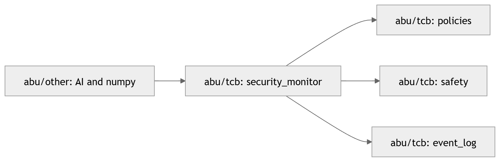
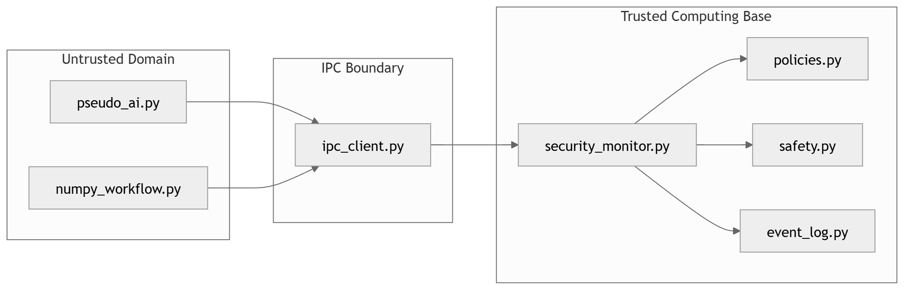
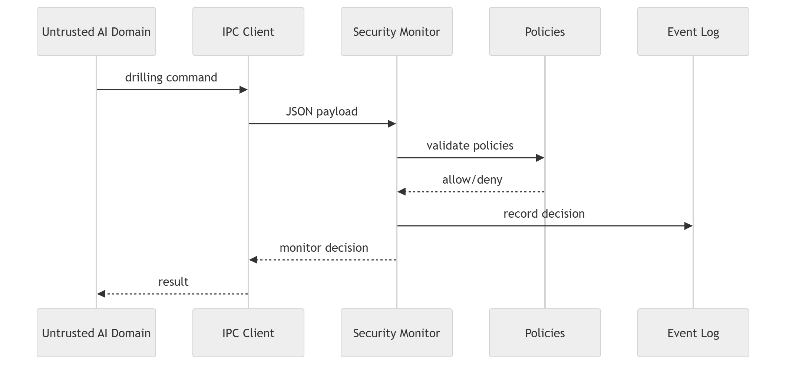

# Отчёт о конкурсном решении АБУ

## 1. Архитектура и границы ДВБ

Решение размещено в:

- `src_solution/`

Архитектура разделена на доверенную вычислительную базу (TCB)
и недоверенный домен.

### Trusted Computing Base (TCB)

Доверенные компоненты расположены в:

- `src_solution/abu/tcb/security_monitor.py`
- `src_solution/abu/tcb/policies.py`
- `src_solution/abu/tcb/safety.py`
- `src_solution/abu/tcb/event_log.py`

TCB отвечает за:
- проверку политик безопасности;
- принятие security-решений;
- emergency stop;
- журналирование;
- контроль допустимых параметров бурения.

### Недоверенный домен

Недоверенные компоненты расположены в:

- `src_solution/abu/other/pseudo_ai.py`
- `src_solution/abu/other/numpy_workflow.py`

Данные компоненты рассматриваются как potentially untrusted
и не входят в доверенную вычислительную базу.

### Разделение процессов и IPC

Для разделения доменов используется process isolation.

Отдельные process-domain компоненты:

- `src_solution/abu/domains/tcb_monitor_process.py`
- `src_solution/abu/domains/other_ai_process.py`

IPC-взаимодействие реализовано через:

- `src_solution/abu/domains/ipc_client.py`

IPC основан на:
- subprocess;
- stdin/stdout;
- JSON payload/messages.

### Критичные домены SG

К security-critical доменам относятся:
- security monitor;
- policies;
- safety;
- event_log.

Все критические проверки выполняются только внутри TCB.

---

## 2. Политики и цели безопасности (SG/SA)

### Security Goals (SG)

| SG | Описание |
|---|---|
| SG-1 | Запрет опасных команд бурения |
| SG-2 | Контроль глубины бурения |
| SG-3 | Контроль RPM |
| SG-4 | Контроль vibration |
| SG-5 | Emergency stop при опасном режиме |
| SG-6 | Изоляция недоверенного AI-домена |
| SG-7 | Auditability через event log |

### Security Assumptions (SA)

| SA | Описание |
|---|---|
| SA-1 | security_monitor является доверенным |
| SA-2 | IPC-интерфейс не модифицируется недоверенным кодом |
| SA-3 | policies.py содержит корректные пороги безопасности |
| SA-4 | event_log доступен только trusted domain |

### Упрощённый TARA-анализ

| Угроза | Последствие | Механизм защиты |
|---|---|---|
| Опасная глубина бурения | Повреждение оборудования | depth policy |
| Превышение RPM | Аварийный режим | RPM validation |
| Высокая vibration | Emergency stop | safety.py |
| Компрометация AI-domain | Неверные рекомендации | trusted security_monitor |
| Некорректные IPC-команды | Обход политик | IPC boundary + monitor |
| Supply-chain риск numpy | Уязвимости outside TCB | вынесение в OTHER domain |

### Политики безопасности

Политики реализованы в:

- `src_solution/abu/tcb/policies.py`

Security monitor:

- `src_solution/abu/tcb/security_monitor.py`

поддерживает SG через:
- validation depth;
- validation RPM;
- validation vibration;
- risk validation;
- emergency stop.

### Default Deny

Архитектура использует принцип:
- default deny.

Команда запрещается, если:
- depth превышает допустимый предел;
- RPM превышает предел;
- vibration превышает threshold;
- risk == high.

Разрешаются только команды,
прошедшие все проверки security_monitor.

### Минимизация security_monitor

Модуль:

- `src_solution/abu/tcb/security_monitor.py`

содержит только security-critical логику.

В monitor intentionally отсутствуют:
- AI-компоненты;
- сложная аналитика;
- внешние зависимости;
- heavy computation.

Это позволяет:
- уменьшить размер TCB;
- упростить аудит;
- повысить testability;
- снизить вероятность security defects.

---

## 3. Тесты и результаты

### Команды запуска

```bash
make tests-all
pipenv run pytest src_solution/tests -q
```

### Результаты тестов

Успешно проходят:
- тесты репозитория;
- тесты решения;
- security-тесты;
- e2e-сценарии;
- coverage-проверки.

### Расширение тестового покрытия относительно стартовой заготовки

Стартовая заготовка содержала базовые тесты:
- app flow;
- safety checks;
- pseudo AI;
- security events.

После разделения решения на trusted/untrusted domain
и добавления process isolation
потребовалось расширение тестового покрытия.

В решение были добавлены:

- `src_solution/tests/test_tcb_monitor.py`
- `src_solution/tests/security/test_domain_processes.py`
- `src_solution/tests/test_certification_coverage.py`
- `src_solution/tests/test_more_app_coverage.py`
- `src_solution/tests/test_other_and_app_coverage.py`

Дополнительные тесты были необходимы для проверки:
- IPC boundary;
- subprocess-based domain isolation;
- trusted monitor logic;
- policy enforcement;
- security decision flow;
- emergency stop;
- cross-domain interaction;
- boundary-value scenarios;
- certification coverage.

Отдельное внимание уделено тестированию:
- allow/deny решений monitor;
- журналирования security events;
- изоляции недоверенного AI-domain;
- минимизации TCB.

Расширение тестов связано с усложнением архитектуры по сравнению со стартовой заготовкой
и необходимо для дополнительной проверки корректности
security-critical компонентов.

### Сквозной сценарий ЦР–АБУ

Сквозной e2e-сценарий включает:
- регистрацию;
- допуск;
- выдачу миссии;
- проверку security monitor.

Статус:
- успешно.

---

## 3.1 Тесты безопасности
### Таблица тестов безопасности
Раздел тестов безопасности описывает соответствие Security Goals
и тестов из `src_solution/tests/security`.

| Цель (SG) | Файлы тестов | Проверяемые файлы | Комментарий |
|---|---|---|---|
| SG-1 | `src_solution/tests/security/test_security_monitor.py` | `src_solution/abu/tcb/security_monitor.py` | Блокировка опасных команд |
| SG-2 | `src_solution/tests/test_policies_and_event_log.py` | `src_solution/abu/tcb/policies.py` | Проверка depth policy |
| SG-3 | `src_solution/tests/test_policies_and_event_log.py` | `src_solution/abu/tcb/policies.py` | Проверка RPM policy |
| SG-4 | `src_solution/tests/test_safety.py` | `src_solution/abu/tcb/safety.py` | Проверка vibration threshold |
| SG-5 | `src_solution/tests/test_safety.py` | `src_solution/abu/tcb/safety.py` | Проверка emergency stop |
| SG-6 | `src_solution/tests/security/test_domain_processes.py` | `src_solution/abu/domains/*` | Проверка process isolation |
| SG-7 | `src_solution/tests/test_policies_and_event_log.py` | `src_solution/abu/tcb/event_log.py` | Проверка журналирования |

---

## 4. Сертификация

### Команды

```bash
make prepare-cert-bundle
make certify-abu
```

### Результат

Сертификация:
- успешно.

### Сертификационные артефакты

SBOM:
- `src_solution/sbom/SBOM_TCB.cdx.json`
- `src_solution/sbom/SBOM_OTHER.cdx.json`
- `src_solution/sbom/sbom_manifest.json`

### Разделение доверенных и недоверенных зависимостей

Библиотека `numpy` используется только
в недоверенном аналитическом домене:

- `src_solution/abu/other/numpy_workflow.py`

`numpy` не участвует в:
- принятии security-решений;
- policy enforcement;
- monitor validation.

Поэтому зависимость intentionally исключена из TCB
и размещена только в:

- `SBOM_OTHER.cdx.json`

Это уменьшает:
- размер доверенной вычислительной базы;
- attack surface;
- сложность сертификации;
- риски supply-chain vulnerabilities.

---

## 5. Итог оценки

### Результат evaluate-score

Ключевые результаты:
- все тесты проходят успешно;
- flake8 без ошибок;
- TCB coverage = 100%;
- security_monitor coverage = 100%;
- SBOM корректен;
- process/domain isolation реализован;
- сертификация проходит успешно.

### Сильные стороны решения

- минимизированный TCB;
- process isolation;
- IPC boundary;
- security monitor;
- event logging;
- default deny architecture;
- разделение trusted/untrusted компонентов;
- security test coverage;
- корректное SBOM-разделение.

### Ограничения

- IPC реализован в упрощённом subprocess-based виде;
- AI-домен является демонстрационным;
- архитектура ориентирована на конкурсный стенд.

---

## 6. Диаграммы

### Архитектура политики безопасности



Диаграмма отражает поток проверки команд бурения.

Недоверенные компоненты `abu/other`
не принимают security-critical решений напрямую
и взаимодействуют с системой только через
`security_monitor`.

Все проверки политик безопасности,
emergency stop и журналирование выполняются внутри TCB.

### Диаграмма доменов и trust boundary



Диаграмма показывает разделение trusted и untrusted domain,
а также минимальный IPC-интерфейс между ними.
Security-critical проверки выполняются только внутри TCB.

### Sequence Diagram основного сценария



Sequence diagram демонстрирует,
что все команды проходят через security_monitor
до выполнения операций бурения.
Недоверенный AI-domain не принимает
security-critical решений напрямую.


---

## Заключение

В решении реализовано:
- разделение trusted/untrusted domain;
- минимизация Trusted Computing Base;
- process isolation;
- IPC boundary;
- policy enforcement;
- security monitoring;
- event logging;
- security-oriented test coverage.

Архитектура ориентирована на уменьшение attack surface
и изоляцию security-critical компонентов.
Все критические операции проходят через security_monitor,
а недоверенные компоненты исключены из доверенной базы.